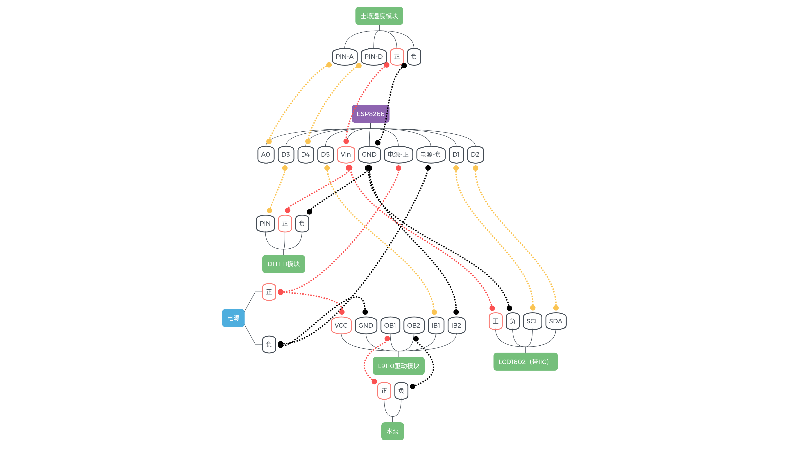

# 基于esp8266的自动浇水项目
### ESP8266 引脚  

### 材料
|  材料   | 价格  |
|  ----  | ----  |
| ESP8266 NodeMcu V3  | 10.13 |
| 真空水泵  | 7.2 |
| L9110两路电机驱动模块  | 9.9 |
| LCD1602（带IIC）	| 10.4 |
| 土壤湿度传感器  | 1.3 |
| DHT11温湿度传感器  | 3.78 |

### 接线
